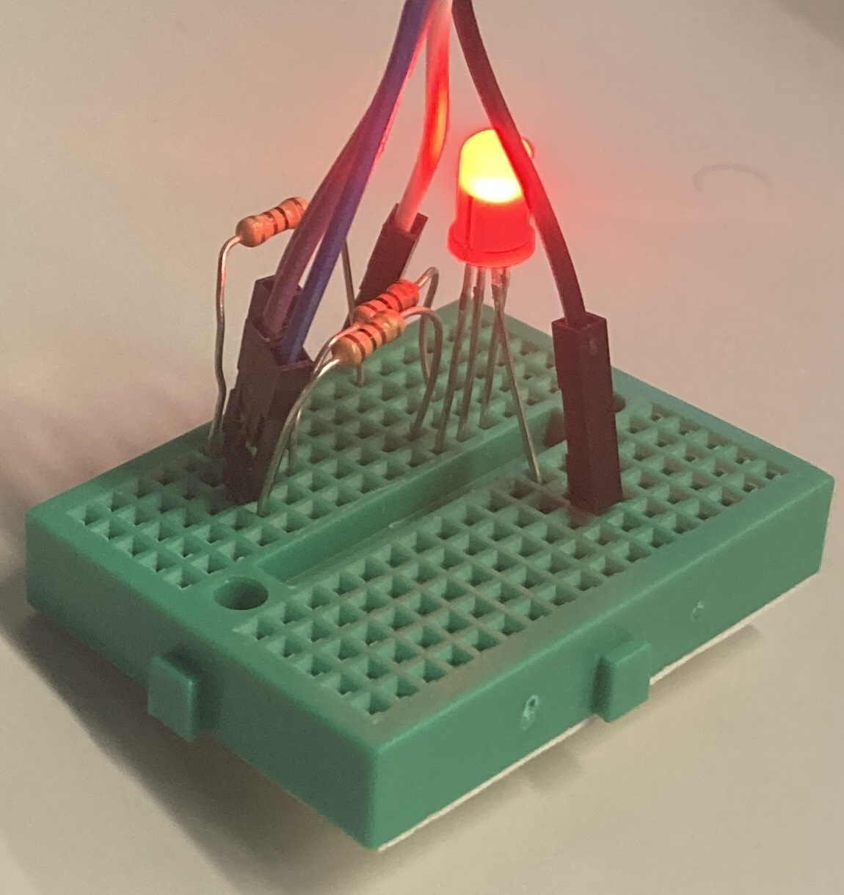
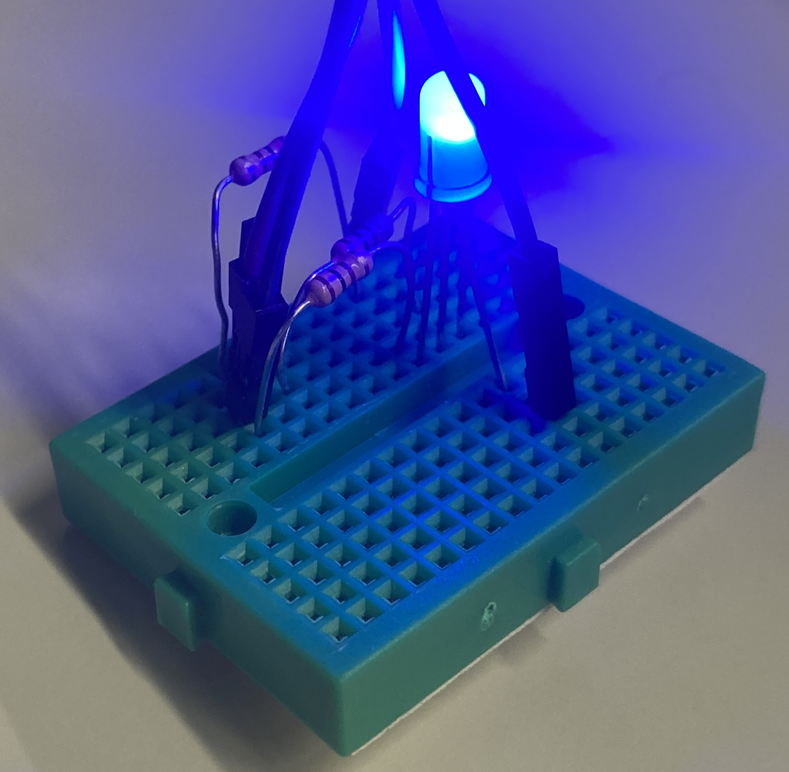
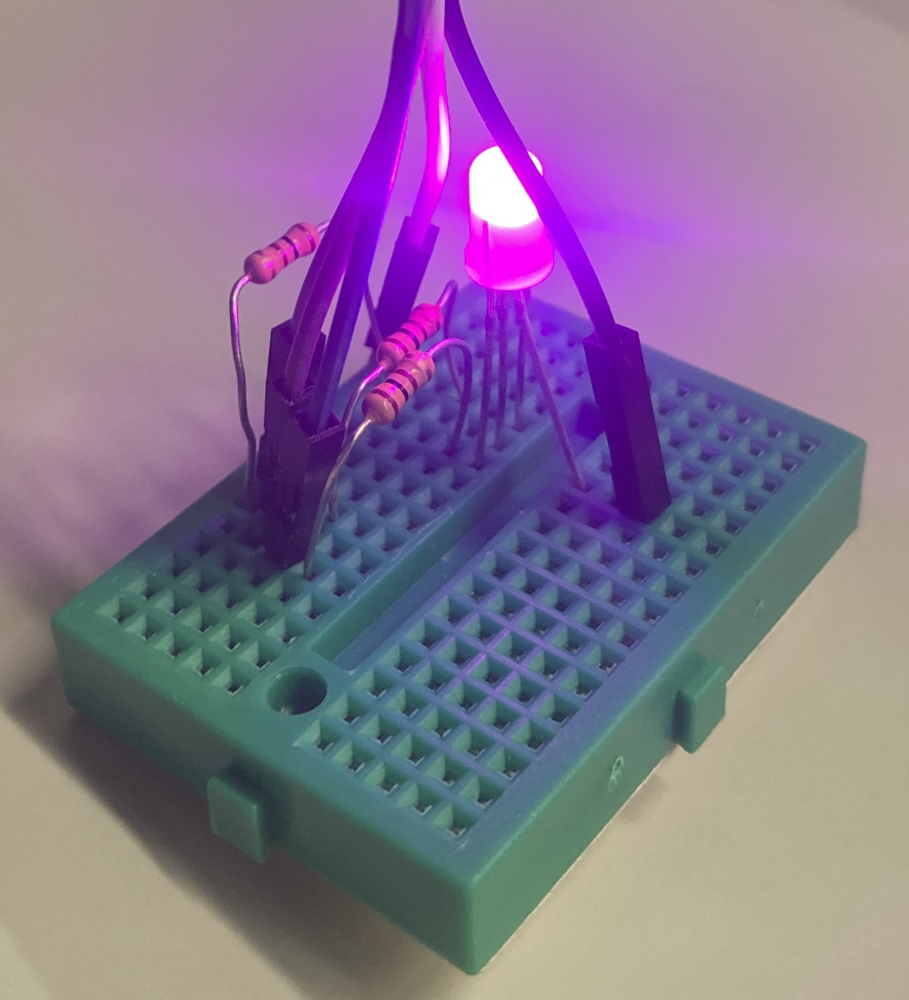

# HW 10: RGB LED Controller VHDL

## Overview
In this homework, I wrote a RGB controller VHDL file and an associated component using Platform Designer. The controller uses three PWM drivers for each of the colors, and reads periods and duty cycle from memory though an Avalon memory bus.

## Math
I used resistors to limit the current through the LEDs to a max of 20 mA:
* Red Forward voltage: 2V-2.2V
$$R_{red} = \frac{3.3V - 2V}{20 mA} = 65 \Omega$$
* Green Forward voltage: 3V-3.2V
$$R_{green} = \frac{3.3V - 3V}{20 mA} = 15 \Omega$$
* Blue Forward voltage: 3V-3.2V
$$R_{blue} = \frac{3.3V - 2V}{20 mA} = 15 \Omega$$
Choosing $100\Omega$ resistors across the board will ensure that all currents are kept below the max of 20 mA.

## Deliverables
Red LED

Green LED

Blue LED

Pink LED
