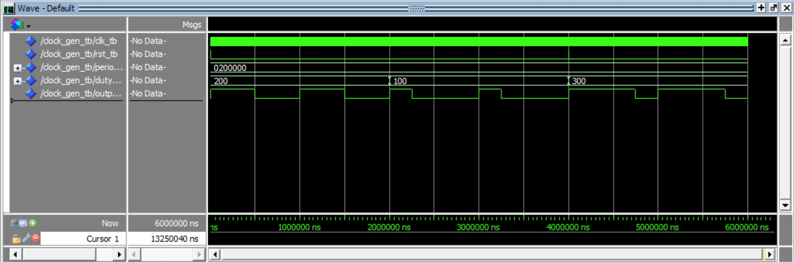
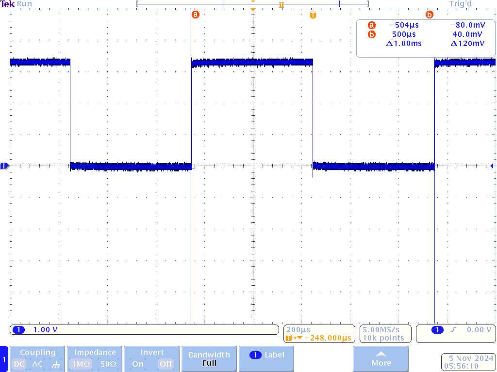
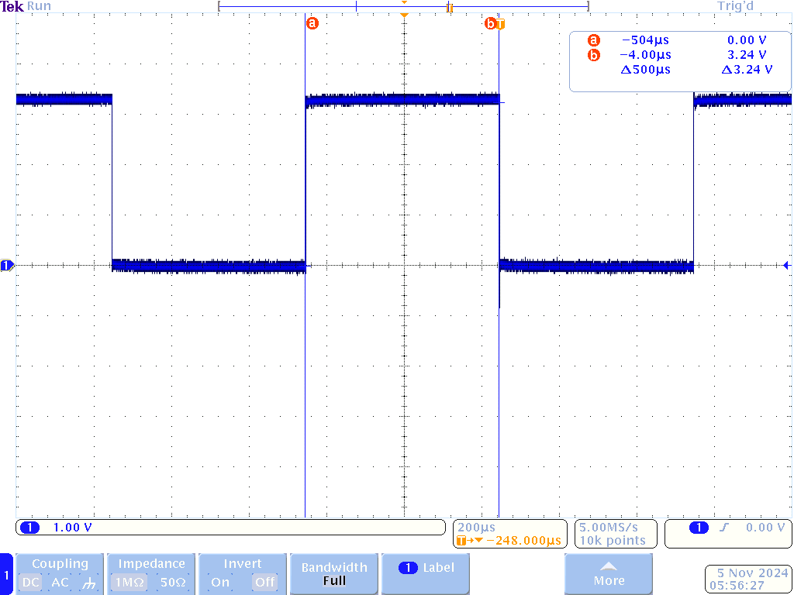

# HW 9: PWM Controller VHDL 

## Overview
Write VHDL file for variable PWM control with adjustable period and duty cycle.

## Deliverables
Test bench for a variety of duty cycles

Period of 1 ms.

Duty cycle of 0.5 ms.
