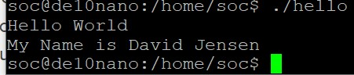

# Lab 3: Developer Setup

## Overview
The goal of this lab was to speed up the process for downloading the bit stream to our FPGA. We did this by setting up directories to boot the FPGA from our virtual machine.

## Deliverables

