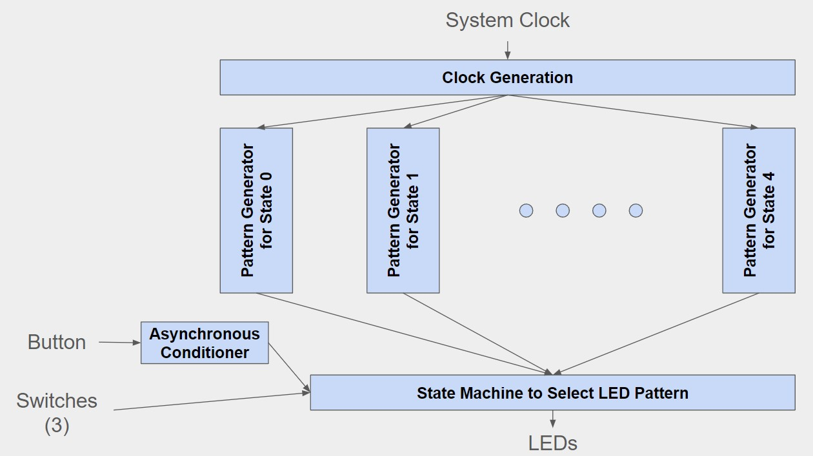
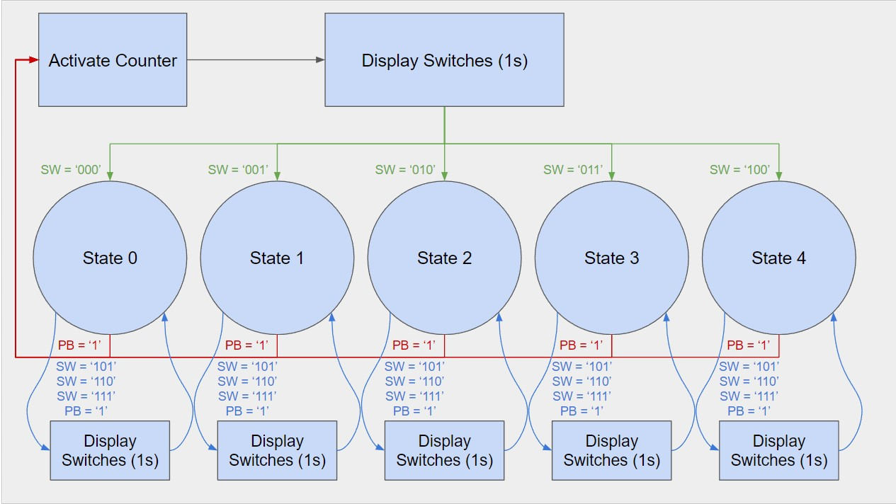

# Lab 4: LED Patterns

## Overview
In Lab 4, a variety of patterns are shown on the LEDs on the FPGA, incorperating a user selection over the switches and a vareity of different clocks used in the different patterns.
### Functional Requirements
The LED control can come from software or hardware and should be selectable. A base is an input and determines the base clock speed for all patterns. For hardware control, led(7) should always blink at the base rate; led(6 downto 0) vary depending on the pattern. For sw='000', one LED should shift right at half the base period; sw='001', two LEDs should shift left at a quarter of the base period; sw='010', a 7-bit up-counter at twice the base period; sw='011', a 7-bit down-counter at an eighth of the base period; sw='100', a custom pattern. When the push button is pressed, the switch values are displayed on the LEDs for a second, and then the selected pattern begins. If the selection is larger than '100', then the previous pattern should be shown.

## System Architecture
### System Block Diagram
Figure 1 shows the block diagram for the complete architecture.

Working from the top down, the first component is the Clock Generator that takes the system clock and outputs a variety of clock periods. It takes the base period and system clock as inputs, and outputs clocks scaled based on the base period. Each pattern generator implements code to display basic patterns on the LEDs and outputs the LED assignments. The push button is synchronized, debouunced, and convered to a one-clock pulse inside of the conditioner. Finally, the LED patterns component instantiates all other components and implements a state machine to display switch values and LED patterns.

### State Diagram
Figure 2 shows the state diagram for the LED pattern state machine.

The state diagram has states for each pattern and transistions to a display state whenever the push button is pressed. The display state lasts for one second folowed by a transition to the selected state (or the previous state for an invalid selection). Not pictured is an idle state that is entered intially and on reset. It is exited on the push button.

## Implementation Details
The custom pattern that was implemented shows a single LED shifting left at quadruple the base rate while another LED shifts right at an eighth of base period. This was implemented by integrating two shifters with an or.