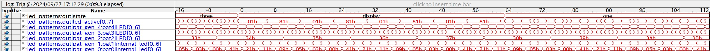

# Lab 5: Signal Tap

## Overview
Lab 5 was an introduction into how to use the signal tap to inspect singals on the FPGA.

Figure 1 shows the waveform of the interal signals when switching from state 3 to state 1.

Figure 2 shows the configuation and sampling depth for the signal tap.

Figure 3 shows the memory used by the signal tap.
