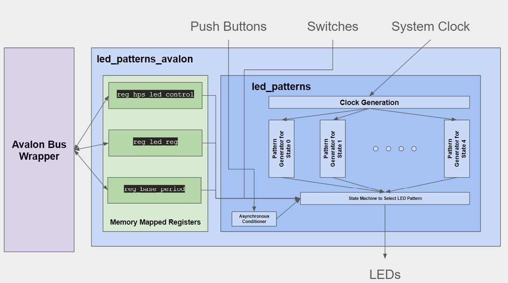
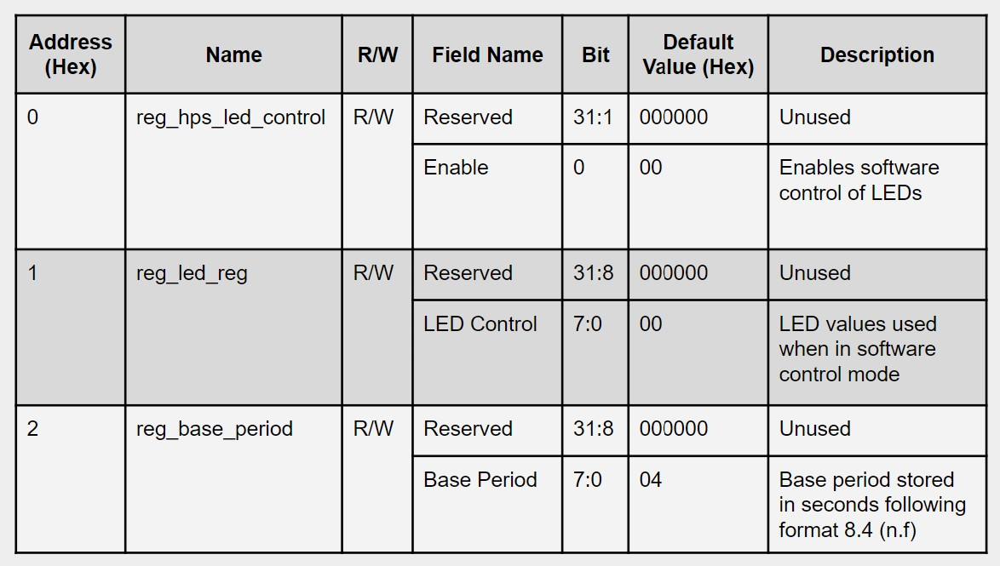

# Lab 6: Creating a Custom Component in Platform Designer

## Overview
In this lab, a custom component was designed using Platform Designer. This component was the led-patterns comonent, and the functionality to connect with the on-board memory was added.

### System Architecture
Similar to the architecture in Lab 4, the first component is the Clock Generator that takes the system clock and outputs a variety of clock periods. It takes the base period and system clock as inputs, and outputs clocks scaled based on the base period. Each pattern generator implements code to display basic patterns on the LEDs and outputs the LED assignments. The push button is synchronized, debouunced, and convered to a one-clock pulse inside of the conditioner. Finally, the LED patterns component instantiates all other components and implements a state machine to display switch values and LED patterns. The led_avalon component instantiates the lad_patterns component, connecting it to the memory-mapped registers.

### Register Map
Three registers were created to allow the led_patterns_avalon component interact with the memory. The first register is `reg_hps_led_control`. This register is used to switch between software and hardware control of the LEDs using the LSB with a `1` corrisponding to software control and a `0` corrisponding to hardware control. The second register is `reg_led_reg`, which holds the eight bits to control the LEDs when in software control in the lowest eight bits (`7 downto 0`). Finally, `reg_base_period` holds the base period used when displaying the patterns under hardware control. The period in seconds is stored in the lowest eight bits (`7 downto 0`) and is in the format 8.4 (n.f).

### Platform Designer
The registers were connected ARM CPUs by following the naming convention `avs_<signal name>`. This inticates to the platform designer that the signals are meant to be connected to the HPS. This connection was facilitated by clicking the small circle to the left of `avalon_slave_0` to connect it to `h2f_lw_axi_master`.

The base address of the comonenet in Platform Designer is `0x0000_0000`.

